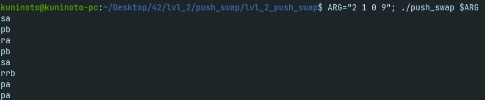

# push_swap (42Porto - 42Cursus)  

## Grade: 90/100

### Description
`push_swap` is a program that sorts a stack of integers with the minimum instructions possible and an auxiliary stack.
Instructions are defined within the subject of the project and they're the only way allowed to
manipulate the data in the stacks.

`checker` is a utility program that, taking the same arguments as `push_swap` and its outputted 
instructions, checks if the stack ends up sorted, thus verifying if `push_swap` is sorting correctly.

### Demonstration

### Installing and running the project

1- Clone this repository
	
	git clone https://github.com/Kuninoto/42_push_swap
2- Run `make`
	
	make
3- `make clean` so that you don't keep those object files that you won't need anymore

	make clean
4- Run `push_swap` with a list of integers of your choice!

	./push_swap <nbr> <nbr> <nbr> <nbr> ...

#### Makefile available targets  
`make` or `make all` - Makes `push_swap`  
`make clean` - Deletes all the resulting object files  
`make fclean` - Deletes `push_swap` and `checker`  
`make re` - fclean + all  
`make bonus` - Makes `checker`  

### Useful links  
[Medium article about the project](https://medium.com/@jamierobertdawson/push-swap-the-least-amount-of-moves-with-two-stacks-d1e76a71789a)  
[Another Medium article about the project](https://medium.com/nerd-for-tech/push-swap-tutorial-fa746e6aba1e)  
[Insertion Sort](https://www.geeksforgeeks.org/insertion-sort/)  
[Merge Sort](https://www.geeksforgeeks.org/merge-sort/)  
[Quick Sort](https://www.geeksforgeeks.org/quick-sort/)  
[Algorithm from another 42 student](https://www.youtube.com/watch?v=7KW59UO55TQ)  
[Handy random number generator to test the program](https://numbergenerator.org/randomnumbergenerator/1-100#!numbers=500&low=1&high=500&unique=true&csv=&oddeven=&oddqty=0&sorted=false&addfilters=)  

## Disclaimer
> At [42School](https://en.wikipedia.org/wiki/42_(school)), almost every project must be written in accordance to the "Norm", the schools' coding standard. As a result, the implementation of certain parts may appear strange and for sure had room for improvement.

---
Made by Nuno Carvalho (Kuninoto) | nnuno-ca@student.42porto.com  

 <a href="https://www.linkedin.com/in/nuno-carvalho-218822247"/> &nbsp;
